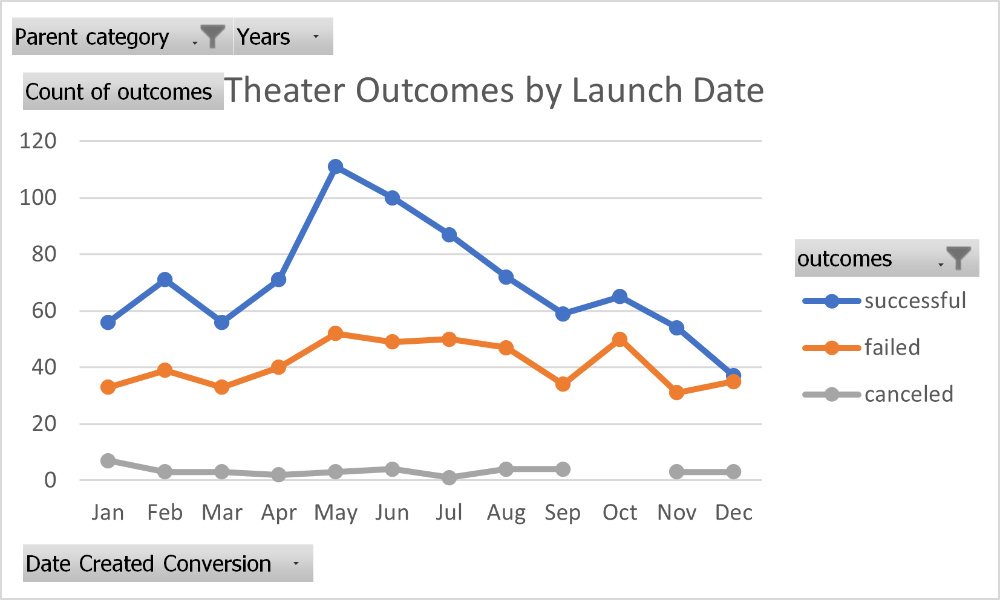
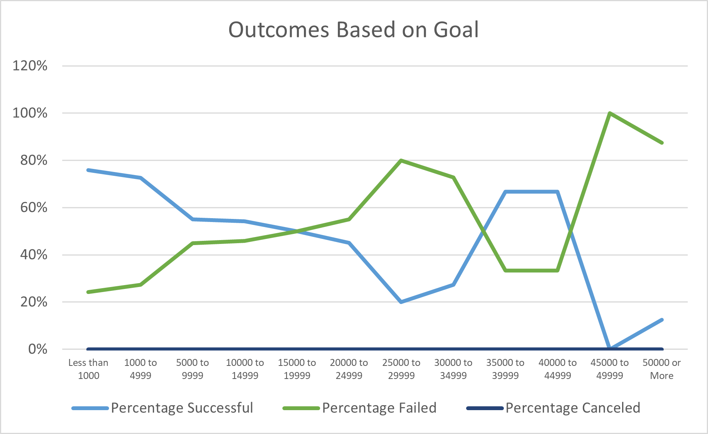

# Kickstarting with Excel

## Overview of Project
Our primary goal was to assist Louise with her crowdfunding campaign to raise more than $10,000 for her forthcoming play "Fever," and to help her make informed decisions for a successful campaign using Excel and the Kickstarter dataset to analyze similar past events and their outcomes, as well as identifying relevant factors that influenced them, enabling Louise to assess different options and strategies to achieve her goal.

## Analysis and Challenges

### Analysis of Outcomes Based on Launch Date
Based on my analysis of the Theater Outcomes by Launch Date chart, it appears that summer months, specifically May to July, offer the greatest potential for success due to people's increased willingness to engage in activities during warmer weather; however, the chart also reveals that there are external factors beyond the season that impact success rates, as evidenced by a significant number of failed events during these months. Conversely, December had the highest percentage of failed events, suggesting that it may not be an ideal time to schedule a play due to people's inclination to spend time at home during the colder months.

### Analysis of Outcomes Based on Goals
The events that had a goal of less than $1,000 to $4,999 had the highest percentage of success, which is not surprising given that it is the lowest range of all; this suggests that as the fundraising goal increases, the chances of failure also increase, with the range between $25,000 to $34,999 and $45,000 to $49,999 showing the highest percentage of failed events. However, events with a goal between $35,000 to $44,999 had a remarkably high success rate of 67%, which could be attributed to their selection of an appropriate target audience or performing during a favorable season. It's noteworthy that there were no canceled events, and the chart demonstrates a clear inflection point where the percentage of success declines as the goal increases until it levels off in the $35,000 to $44,999 range.

### Challenges and Difficulties Encountered
One of the primary limitations of the data is the lack of specific location information for events beyond the country level, which can obscure the impact of external factors such as geography on performance, and the absence of information regarding the target audience of the plays, which is crucial as it reflects the source of the funding and the primary objective of the fundraising.

To mitigate these limitations, we could restrict the analysis to only the events that occurred within the past year, which could provide more accurate and relevant data. Additionally, we could consider creating a graph illustrating the average donation amount to identify which types of plays people are most willing to support.

## Results

Based on the Outcomes by Launch Date data, May and June were the most successful months for campaigns, whereas December had the poorest success rate. Upon reviewing the Outcomes by Goals data, I concluded that a campaign goal of no more than $4,999 is advisable. However, the limitation of the dataset is that it lacks filtering by parent category, which could provide a more nuanced analysis of each category. To address this limitation, filtering by year could also reveal areas for potential improvement. To gain a comprehensive overview of all parent categories, another Outcomes by Launch Date graph could be created, along with separate Outcomes by Goals graphs for each parent category, to yield a more thorough analysis of campaign outcomes. 
